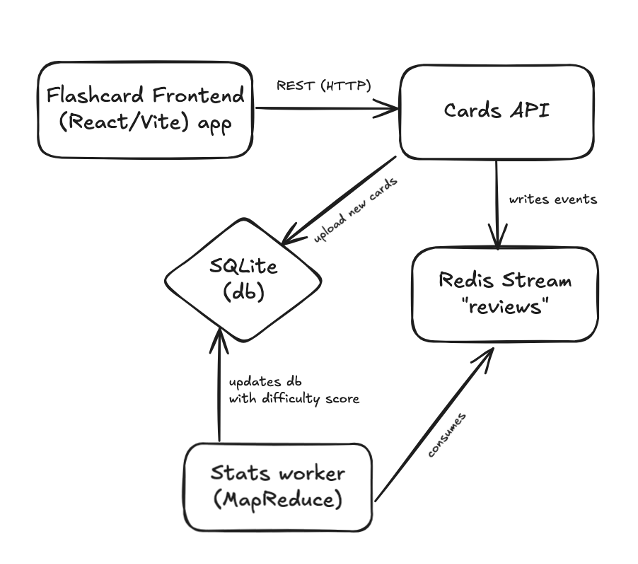

# Study Cards

**Study Cards** is a web-based flashcard application designed to create, review, and track learning progress using flashcards. The project provides a modern frontend, a RESTful API backend, and a background worker for statistics. It uses SQLite for storage and Redis Streams for event processing.

## Features

- Create and manage flashcards with custom content
- Review cards and track your progress
- Automatic difficulty adjustment based on your answers
- Bulk upload of cards supported
- REST API for integration
- Background worker for statistics
- Deployable with Docker and Kubernetes

## Tech Stack

- **Frontend:** React, Vite, TailwindCSS
- **Backend API:** Fastify, better-sqlite3, ioredis
- **Worker:** Node.js, Fastify, better-sqlite3, ioredis
- **Database:** SQLite
- **Messaging/Event:** Redis Streams
- **Dev Tools:** TypeScript, ESLint, Nodemon
- **Deployment:** Docker, Kubernetes

## Microservices

## License

This project is licensed under the [MIT License](./LICENSE).

It makes use of open-source dependencies and tools under permissive licenses (MIT, BSD, or Apache-2.0), including but not limited to:

- **React**, **Vite**, **TailwindCSS** – MIT
- **Fastify**, **ioredis**, **better-sqlite3** – MIT
- **TypeScript**, **ESLint**, **Nodemon** – MIT
- **Kubernetes (K8s)** manifests and API conventions – Apache-2.0
- **SQLite** engine – Public Domain (SQLite license)

All third-party dependencies remain governed by their respective licenses.
